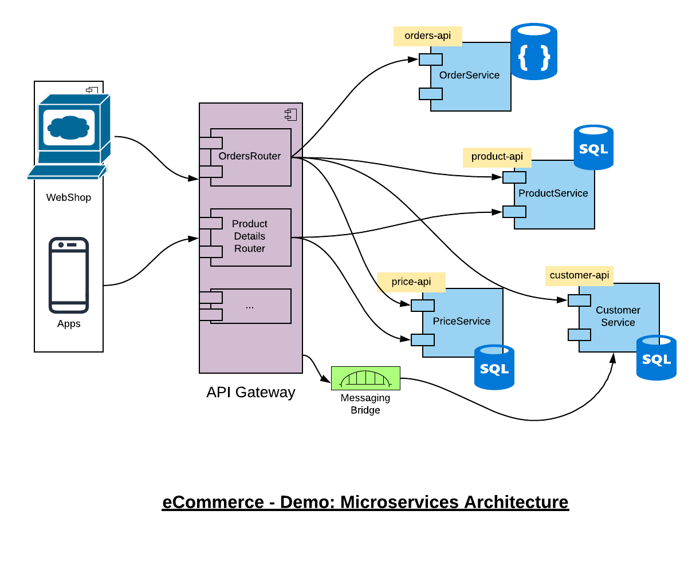
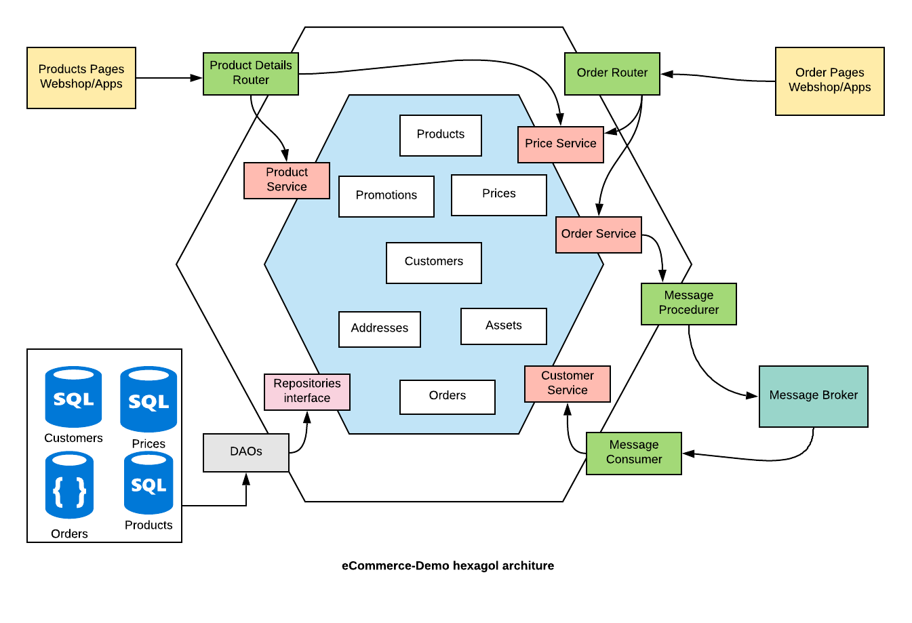
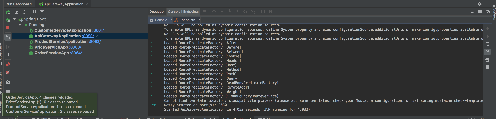

# eCommerce-Demo

A concert of an eCommerce system based on Microservices Architecuture with API Gateway

## Architecture
### Microservices Architecture Desgin



### Domain Driven Design 


## Runbook

### Build Script
### Set permission for the build script
 
```chmod +x build.sh```
 
### Run build script

``` ./build.sh```

Note:
org.openapitools:openapi-generator-gradle-plugin is not (yet) comparative with Gradle 4. Please use gradlew wrapper from the project if you are using Gradle 5 
 
 ## Run Script
Please run application by using an IDE.
The run.sh is not recommended out side of a docker. 


